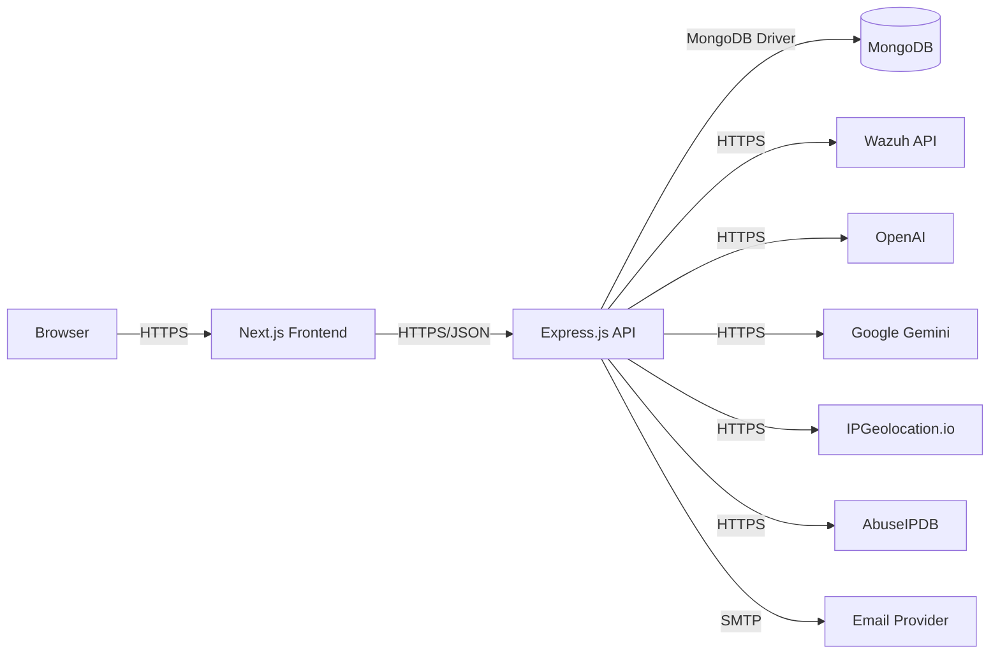

# SENTRYA – Security Case Management Platform

SENTRYA is a full‑stack (Next.js + Express + MongoDB) security case management platform with RBAC, SLA tracking, analytics, notifications, and SIEM + AI integrations. It connects to Wazuh for alert ingestion and uses OpenAI/Gemini to accelerate remediation, risk assessment, and reporting.

## Highlights

- Role‑based access (admin, senior_analyst, analyst, viewer) with JWT auth and account lockout
- Case lifecycle: create/assign/comment/timeline/SLA/escalation/closure
- Dashboards: overview, SLA compliance, analyst performance, trends, geo analytics
- Integrations: Wazuh SIEM, IP analysis (IPGeolocation.io + AbuseIPDB)
- AI assistance: remediation, MITRE/compliance mapping, risk scoring, executive reports
- Notifications: assignment, closure, SLA escalation, daily digest

## Architecture



## Tech Stack

- Frontend: Next.js 14, React, Tailwind CSS
- Backend: Node.js, Express.js
- Database: MongoDB (Mongoose)
- Auth: JWT
- Integrations: Wazuh REST API, OpenAI, Google Gemini, IPGeolocation.io, AbuseIPDB

## Repository Layout

```
case-management-system/
├── backend/
│   ├── src/
│   │   ├── config/           # database
│   │   ├── middleware/       # auth, error handler
│   │   ├── models/           # Mongoose schemas
│   │   ├── routes/           # Express routes
│   │   ├── services/         # Wazuh, AI, IP analysis, email, cron
│   │   └── utils/            # logger
│   └── server.js
├── frontend/
│   ├── src/
│   │   ├── app/              # Next.js routes (cases, ai-assistant, siem, users, geo)
│   │   ├── components/
│   │   ├── providers/        # AuthProvider
│   │   └── services/         # API client
│   └── public/
├── docs/                     # Project_Report.md and docs
├── wazuh-docker/             # Wazuh single-node example
├── README.md                 # You are here
├── SETUP.md
└── TESTING_CHECKLIST.md
```

## Quick Start (Dev)

1. Backend

```bash
cd backend
npm install
export PORT=5000
export MONGODB_URI="mongodb://localhost:27017/wazuh_case_management"
# Optional integrations
export OPENAI_API_KEY=...
export GEMINI_API_KEY=...
export WAZUH_API_URL=https://localhost:55000
export WAZUH_USERNAME=wazuh-wui
export WAZUH_PASSWORD=...
export IPGEOLOCATION_API_KEY=...
export ABUSEIPDB_API_KEY=...
export FRONTEND_URL=http://localhost:3000
npm run dev
```

2. Frontend

```bash
cd frontend
npm install
export NEXT_PUBLIC_API_URL="http://localhost:5000/api"
npm run dev
```

Open the app at http://localhost:3000 and log in (the login page shows demo credentials), or register a new user.

## Environment Variables (summary)

- Backend: `MONGODB_URI`, `PORT`, `JWT_SECRET`, `OPENAI_API_KEY`, `GEMINI_API_KEY`, `WAZUH_API_URL`, `WAZUH_USERNAME`, `WAZUH_PASSWORD`, `IPGEOLOCATION_API_KEY`, `ABUSEIPDB_API_KEY`, `FRONTEND_URL`, `LOG_LEVEL`
- Frontend: `NEXT_PUBLIC_API_URL`

## Integration Flow

```
Wazuh SIEM → API (Transform) → Case Creation → Assignment → SLA/Timeline → Resolution → Analytics
```

## Links

- Backend docs: `backend/README.md`
- Frontend docs: `frontend/README.md`
- Full project report: `docs/Project_Report.md`
